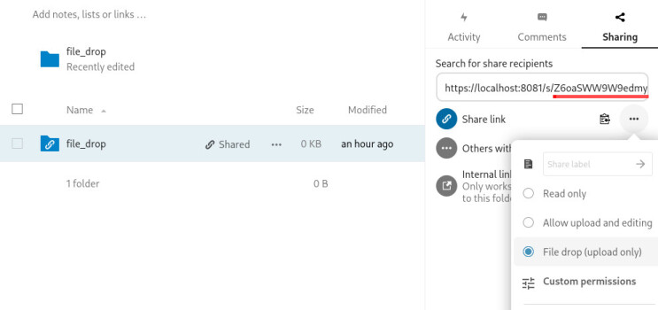

# nextcloud-filedrop plugin

## Overview

This plugin provides permanent storage of data collected during an experiment using a nextcloud instance. 
It does not require setup of a PHP server or a database as shown in the [documentation]((https://www.jspsych.org/latest/overview/data/)).
The experiment (html and JS files) can thus be hosted on a static http server.
It uses nextcloud's [file drop](https://nextcloud.com/file-drop/) method.

In most cases, however, the plugin requires the nextcloud server to accept **Cross-Origin Resource Sharing (CORS)**, e.g., allow requests from the webpage host (documented [here](https://developer.mozilla.org/en-US/docs/Web/HTTP/CORS)). 
For security reasons, nextcloud instances usually do not accept CORS.
It may thus be neccessary to setup and host your own nextcloud instance.
How a nextcloud docker container with the required permissions can be created is documentet [below](#nextcloud-docker-image).

The plugin uses JSZip to create an in-memory zip file of the collected data, which will be uploaded.
If you use the plugin, please make sure to also load the JSZip library as indicated below.

## Loading

### In browser

```js
<script src="https://unpkg.com/jszip/dist/jszip.js"/></script>
<script src="https://unpkg.com/@jspsych-contrib/plugin-nextcloud-filedrop@1.0.0"/></script>
```

### Via NPM

```
npm install @jspsych-contrib/plugin-nextcloud-filedrop
```

```js
import jsPsychNextcloudFiledropPlugin from '@jspsych-contrib/plugin-nextcloud-filedrop';
```

## Compatibility

This extension was developed for, and tested with jsPsych v7.3.0. 

## Documentation


### Create File Drop Folder

To use the plugin, you need to share a folder using file drop.
To share a folder via file drop, click the *share* icon next to the folder.
In the sharing pane that pops up on the right, click the three dots and select *File drop (upload only)*.



The URL from which the folder is accessible will be copied to the clipboard.
Just paste it somewhere, e.g., in the search field as in the above image, or into a text editor. 
The URL has a format like `https://<domain>/s/<random_string>`.
Select and copy the random string in the URL following the last slash (marked in red in the image).
It becomes the `folder` parameter of the plugin.

The contents of the directory, e.g., previously uploaded files, will not be visible.
The files will not be overriden. 
Files with the same filename will automatically be enumerated.

> **_IMPORTANT:_**  Please ensure secure data transfer via SSL/TLS encryption, i.e., use https instead of http. 

### Trial Parameters

This plugin accepts the following parameters:


```js
var trial = {
    type: jsPsychNextcloudFiledropPlugin,
    url: 'https://nextcloud.foo.com',
    // The random string obained from the share link, i.e.,
    // the string following the last slash in the link.
    folder: 'Z6oaSWW9W9edmyk',
    filename: null,
    generate_download_url_on_error: true
  };
```

Parameter | Type | Default Value | Description
----------|------|---------------|------------
url | STRING | undefined | The URL of the nextcloud instance.
folder | STRING | undefined | The random string copy-pasted from the share link ([see](#create-file-drop-folder)).
filename | FUNCTION | null | A function `(this.jsPsych) => { return ... }` returning the name of the zip file that will be uploaded. If `null`, the filename will be generated from the actual date.
generate_download_url_on_error | BOOL | false | When the upload failed, should the browser generate an internal URL for the generated ZIP file. This URL may be used by the user for download the ZIP file such that the data can be transferred later.


## Nextcloud docker image

To test the plugin locally, a nextcloud instance can be set up using docker.
Note that this example does not use TSL encryption.
Without TSL, the data can be read by third parties. 
It is **no recommended** to use this setup for data collection.

We assume docker to be installed and configured (we recommend podman for use of rootless containers).
Execute the following command in a shell with sufficient privileges.

### 1. Create and Run
Create and run the docker container as a daemon and provide the nextcloud insance loclly on port 8081.

``` sh
docker run -d --name nextcloud -p 8081:80 docker.io/library/nextcloud
````

### 2. Setup Nextcloud

Open your browser and navigate to [http://localhost:8081](http://localhost:8081).
Enter a username and password for the admin user.

### 3. Configure CORS

The nextcloud instance need to accept CORS from the webserver.
We adapt the example apache configuration from [here](https://github.com/perry-mitchell/webdav-client/issues/116#issuecomment-496032465).
Execute the following two lines.

``` sh
RULES='
# Add security and privacy related headers 
SetEnvIf Origin "http(s)?://(.*)$" AccessControlAllowOrigin=$0 
Header always set Access-Control-Allow-Origin %{AccessControlAllowOrigin}e env=AccessControlAllowOrigin 
Header always set Access-Control-Allow-Methods: "GET,POST,OPTIONS,DELETE,PUT,PROPFIND" 
Header always set Access-Control-Max-Age 1728000 
Header always set Access-Control-Allow-Headers: "Access-Control-Allow-Headers, Origin, Accept, X-Requested-With, Content-Type, Access-Control-Request-Method, Access-Control-Request-Headers, Authorization, X-CSRF-Token, Depth, OCS-AP$" 
Header always set Access-Control-Allow-Credentials true 
SetEnv modHeadersAvailable true 
Header set X-Content-Type-Options "nosniff" 
Header set X-XSS-Protection "1; mode=block" 

RewriteEngine On 
RewriteCond %{REQUEST_METHOD} OPTIONS 
RewriteRule ^(.*)$ $1 [R=200,L]
'
```

``` sh
docker exec nextcloud sh -c "echo '$RULES' >> /var/www/html/.htaccess"
```

> **_IMPORTANT:_** This gives CORS permission from `http(s)?://(.*)$`, i.e., from **everywhere**. 
> This is OK for local testing, but should not be used for public data collection.
> In this case, replace it with the url of your webserver, i.e., `https://my.nextcloud.instance$`.
> Remind to put the dollar sign to the end.

### 4. Remove Container

After testing, stop and remove the container with

```sh
docker stop nextcloud
docker rm nextcloud
```

Finally, you can prune the unnamed volume that was created. 
Please remind that this will remove **all** unused volumes.
```sh
docker volume prune
```
