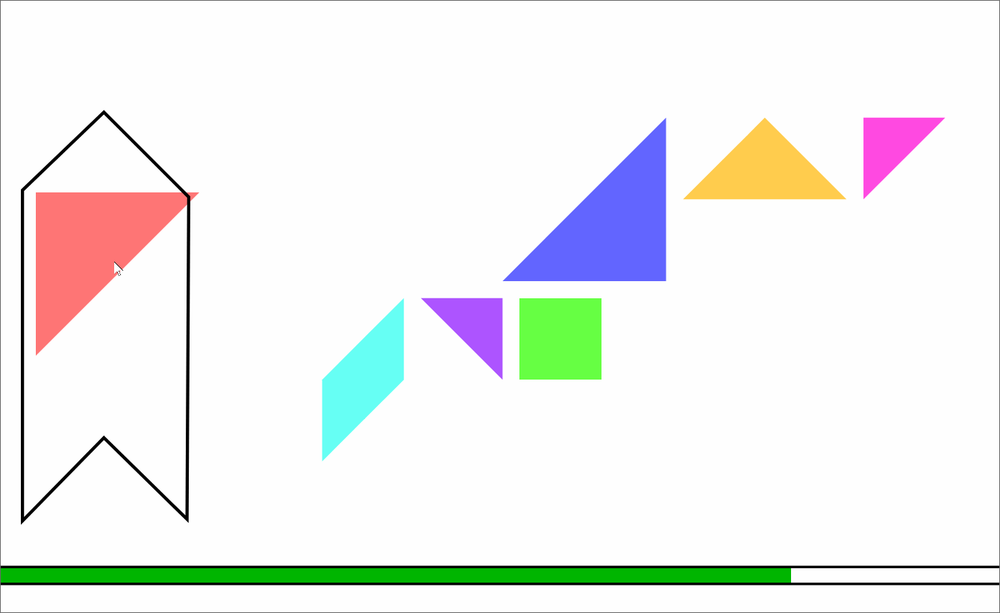

# plugin-tangram-game

## Overview

A child-friendly tangram game with click-and-click interface and potential for custom puzzles



## Loading

### In browser

```html
<script src="https://unpkg.com/@jspsych-contrib/plugin-tangram-game">
```

### Via NPM

```
npm install @jspsych-contrib/plugin-tangram-game
```

## Compatibility

`@jspsych-contrib/plugin-tangram-game` requires jsPsych v8.0.0 or later.

## Documentation

See [documentation](https://github.com/jspsych/jspsych-contrib/packages/plugin-tangram-game/docs/plugin-tangram-game.md)

## Author / Citation

[Aline Normoyle](https://github.com/alinen)

# How to build and run

From the plugin-tangram-game directory, we can install dependencies and build using npm from Node.js. 

```
npm i
npm run build
```

You will need to run a webserver to preview the game locally. For example, using Node.js's http-server. 

```
http-server -c10
```

Then go to `http://127.0.0.1:8080/examples/example1.html` or `http://127.0.0.1:8000/examples/example2.html` in your browser.
Alternatively, if you're using VSCode you can install the Live Server extension. this will also act as a web server for running.
